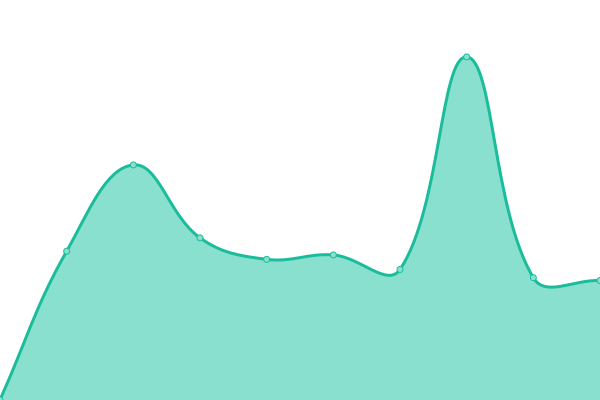

# [📈 Live Status](https://status.teahou.se): <!--live status--> **所有系统均正常**

This repository contains the open-source uptime monitor and status page for [Teahouse Studios](https://teahou.se/), powered by [Upptime](https://github.com/upptime/upptime).

With [Upptime](https://upptime.js.org), you can get your own unlimited and free uptime monitor and status page, powered entirely by a GitHub repository. We use [Issues](https://github.com/Teahouse-Studios/status/issues) as incident reports, [Actions](https://github.com/Teahouse-Studios/status/actions) as uptime monitors, and [Pages](https://status.teahou.se) for the status page.

<!--start: status pages-->
<!-- This summary is generated by Upptime (https://github.com/upptime/upptime) -->
<!-- Do not edit this manually, your changes will be overwritten -->
<!-- prettier-ignore -->
| URL | Status | History | Response Time | Uptime |
| --- | ------ | ------- | ------------- | ------ |
|  [Teahouse Studios 主页（Home）](https://teahou.se/) | 在线 | [teahouse-studios-home.yml](https://github.com/Teahouse-Studios/status/commits/master/history/teahouse-studios-home.yml) | 

 778ms
     
 | 

<a href="https://status.teahou.se/history/teahouse-studios-home">100.00%</a>
    

|  [梗体中文 · 在线构建（Web Builder）](https://dl.meme.teahou.se) | 在线 | [web-builder.yml](https://github.com/Teahouse-Studios/status/commits/master/history/web-builder.yml) | 

 775ms
     
 | 

<a href="https://status.teahou.se/history/web-builder">100.00%</a>
    

|  [Web Builder CDN 服务](https://fe.wd-ljt.com/meme/index.html) | 在线 | [web-builder-cdn.yml](https://github.com/Teahouse-Studios/status/commits/master/history/web-builder-cdn.yml) | 

 1152ms
     
 | 

<a href="https://status.teahou.se/history/web-builder-cdn">99.03%</a>
    

|  [Web Builder API 服务](https://meme.wd-api.com/) | 在线 | [web-builder-api.yml](https://github.com/Teahouse-Studios/status/commits/master/history/web-builder-api.yml) | 

 1216ms
     
 | 

<a href="https://status.teahou.se/history/web-builder-api">98.83%</a>
    

<!--end: status pages-->

[**Visit our status website →**](https://status.teahou.se)

## 📄 License

- Powered by: [Upptime](https://github.com/upptime/upptime)
- Code: [MIT](./LICENSE) © [Teahouse Studios](https://teahou.se/)
- Data in the `./history` directory: [Open Database License](https://opendatacommons.org/licenses/odbl/1-0/)
